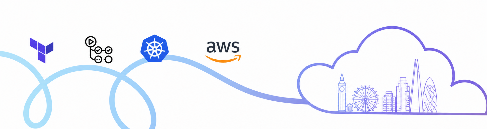

  

<h1 align="center">Hey, I'm Tahmid 👋🏽</h1>

  <strong>DevOps & Full-Stack Engineer</strong> · Building scalable cloud infrastructure, CI/CD pipelines, and production-ready applications

  I'm a London-based engineer focused on cloud infrastructure, automation, observability, and scalable frontend systems.  
  I enjoy building reliable platforms, documenting my learning publicly, and combining software engineering with DevOps to ship systems that actually last.

---

<h3 align="center">🛠️ Tech Stack</h3>

  
  
  
  
  
  
  
  
  
  
  
  
  
  
  
  
  
  
  
  
  
  
  

---

<h3 align="center">🚀 Projects</h3>

| Project                                                                                    | Description                                                                                                     |
| ------------------------------------------------------------------------------------------ | --------------------------------------------------------------------------------------------------------------- |
| **[Umami ECS Deployment](https://github.com/tahmidachoudhury/ecs-umami-analytics)**        | Production-style AWS ECS Fargate deployment using Terraform, ECR, ALB, ACM, Route53, and RDS                    |
| **[GlobeBounds](https://github.com/tahmidachoudhury/globebounds)**                         | Geospatial visualisation platform deployed to AWS S3 + CloudFront via GitHub Actions CI/CD                      |
| **[Exam Builder](https://github.com/tahmidachoudhury/exambuilder)**                        | GCSE Maths Exam Builder with LaTeX PDF generation, observability stack, and automated deployment workflows      |
| **[LumenWalk](https://github.com/tahmidachoudhury/lumenwalk)**                             | Dockerised full-stack application deployed to AWS EC2 with NGINX reverse proxy, HTTPS, CI/CD, and observability |
| **[TiiQu Knowledge Graph](https://github.com/tahmidachoudhury/knowledge-graph-prototype)** | Scalable graph visualisation system for 100k+ nodes using D3.js and Deck.GL                                     |
| **[Salah Seeker](https://github.com/tahmidachoudhury/salah-seeker)**                       | Expo + Mapbox mobile app for discovering nearby prayer spaces with Qibla compass and prayer times               |

📈 View more projects

 

Check out my repositories and technical write-ups for more projects covering:

- AWS infrastructure & Terraform
- ECS & container orchestration
- Observability & monitoring
- CI/CD pipelines
- Frontend engineering
- Linux & automation
- Geospatial visualisation systems

---

<!-- <h3 align="center">Currently Learning</h3>

  AWS ECS · Kubernetes · Advanced Terraform · Observability Engineering · Platform Engineering · Linux Internals · Distributed Systems

--- -->

<h3 align="center">Connect with Me</h3>

  
  
  

---

<h3 align="center">What I Focus On</h3>

  Building reliable infrastructure · Automating deployments · Creating scalable systems · Improving developer workflows · Shipping production-ready applications

---

  

